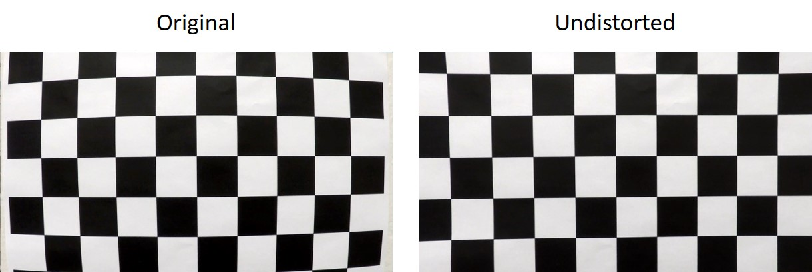
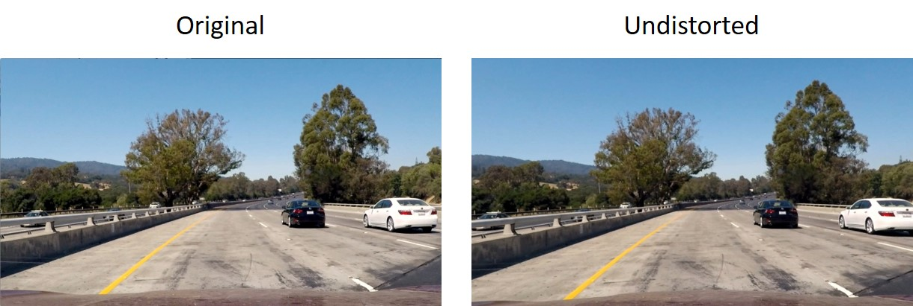
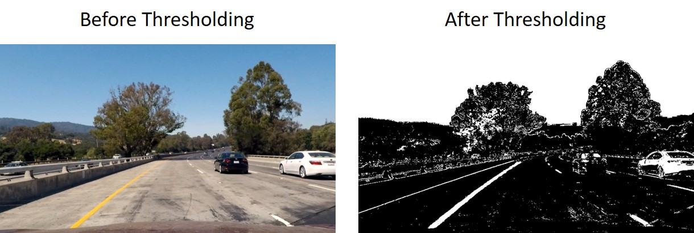
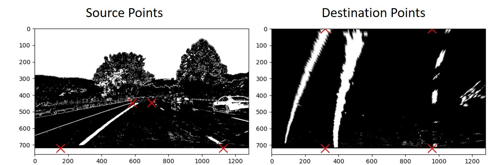
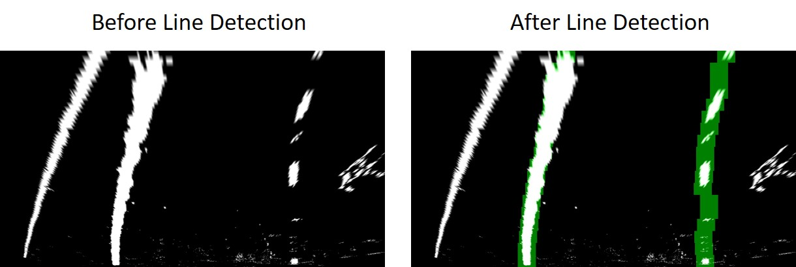
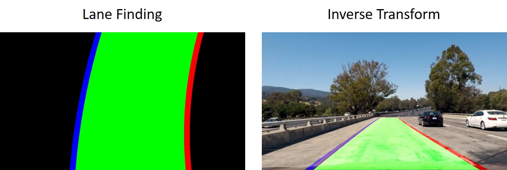
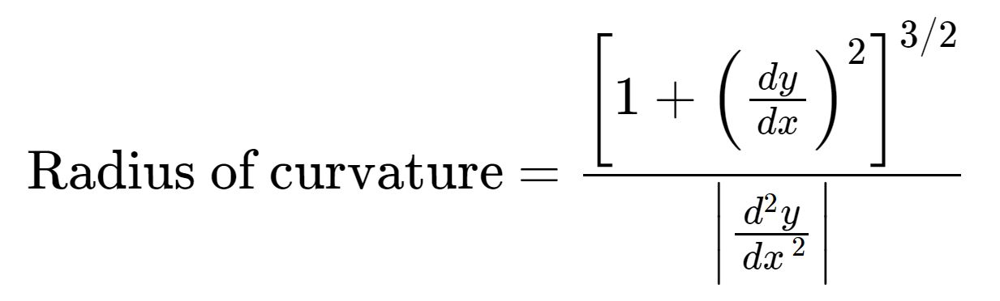
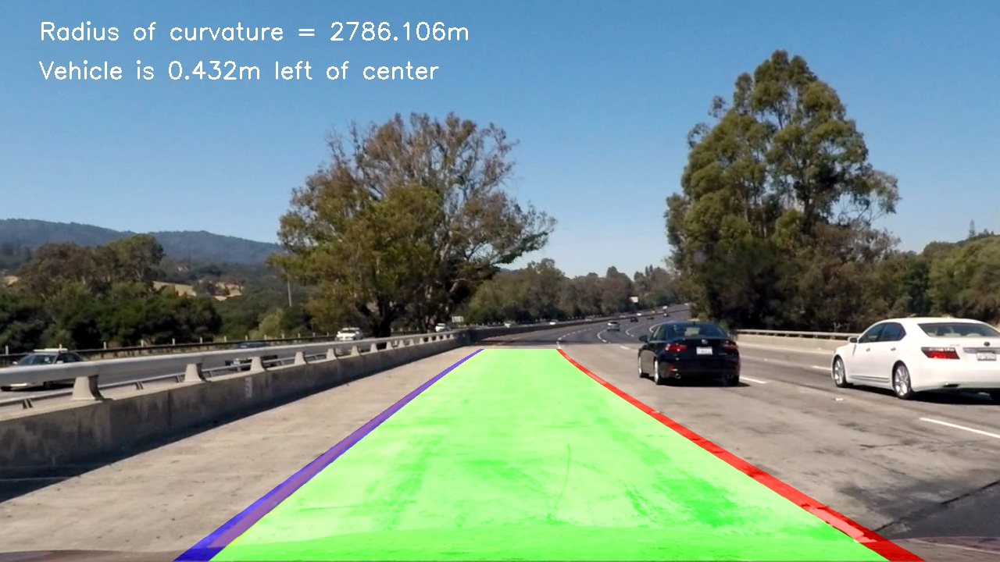

## Advanced Lane Finding
[](http://www.udacity.com/drive)

<br>

<div align="center">
  
</div>

<br>

<p align="center">
  <b><i>Advanced Lane Finding Output.</i></b>
</p>

The Project
---

The goals / steps of this project are the following:

* Compute the camera calibration matrix and distortion coefficients given a set of chessboard images.
* Apply a distortion correction to raw images.
* Use color transforms, gradients, etc., to create a thresholded binary image.
* Apply a perspective transform to rectify binary image ("birds-eye view").
* Detect lane pixels and fit to find the lane boundary.
* Determine the curvature of the lane and vehicle position with respect to center.
* Warp the detected lane boundaries back onto the original image.
* Output visual display of the lane boundaries and numerical estimation of lane curvature and vehicle position.

Camera Calibration
---

The code for this step is contained in the file called Camera_Calibration.py. 

I start by preparing "object points", which will be the (x, y, z) coordinates of the chessboard corners in the real world. Here I am assuming the chessboard is fixed on the (x, y) plane at z=0, such that the object points are the same for each calibration image.  Thus, `objp` is just a replicated array of coordinates, and `objpoints` will be appended with a copy of it every time I successfully detect all chessboard corners in a test image.  `imgpoints` will be appended with the (x, y) pixel position of each of the corners in the image plane with each successful chessboard detection.  

I then used the output `objpoints` and `imgpoints` to compute the camera calibration and distortion coefficients using the `cv2.calibrateCamera()` function.  I applied this distortion correction to the test image using the `cv2.undistort()` function and obtained the following result:

<br>

<div align="center">
  
</div>

<br>

<p align="center">
  <b><i>Camera Calibration Output</i></b>
</p>

Lane Finding Pipeline (single images)
---

### 1. Distortion-Correction

The pipeline starts with correcting the distortion of the road image. Again, I applied this distortion correction using the `cv2.undistort()` function (line 85 in `Lane_Finder_Image.py`). The result can be seen in the following image:

<br>

<div align="center">
  
</div>

<br>

<p align="center">
  <b><i>Road Distortion-Correction Output</i></b>
</p>


### 2. Thresholded Binary Image

I used a combination of color and gradient thresholds to generate a binary image (thresholding steps at lines 90 through 94 in `Lane_Finder_Image.py`). For color thresholding I used Saturation and Value which produce great results independently of light levels. For gradient thresholding I took advantage of the fact that the lane lines in the pictures are close to vertical. Here's an example of my output for this step.

<br>

<div align="center">
  
</div>

<br>

<p align="center">
  <b><i>Picture Thresholding Output</i></b>
</p>

### 3. Perspective Transform

The code to calculate the perspective transform M appears in lines 99 through 130 in the file `Lane_Finder_Image.py` The perspective transform takes the image `binary_output` as input, and maps `source_points` to `destination_points`. The points used are listed below:

```python
source_points = np.float32(
    [
        [img_size[0] * (0.5 - top_width / 2), img_size[1] * height_percentage],
        [img_size[0] * (0.5 + top_width / 2), img_size[1] * height_percentage],
        [img_size[0] * (0.5 - bottom_width / 2), img_size[1] * bottom_trim],
        [img_size[0] * (0.5 + bottom_width / 2), img_size[1] * bottom_trim],
    ]
)

destination_points = np.float32(
    [
        [offset, 0],
        [img_size[0] - offset, 0],
        [offset, img_size[1]],
        [img_size[0] - offset, img_size[1]],
    ]
)
```

This resulted in the following source and destination points:

| Source        | Destination   | 
|:-------------:|:-------------:| 
| 582.4, 446.4      | 320.0, 0.0        | 
| 697.6, 446.4      | 960.0, 0.0      |
| 153.6, 720.0     | 320.0, 720.0      |
| 1126.4, 720.0      | 960.0, 720.0        |

I verified that my perspective transform was working as expected by drawing the `src` and `dst` points onto a test image and its warped counterpart to verify that the lines appear parallel in the warped image.

<br>

<div align="center">
  
</div>

<br>

<p align="center">
  <b><i>Picture Thresholding Output</i></b>
</p>

### 4. Lane-Line Pixels Identification & Fitting

The Lane pixel identification is done by the `find_window_centroids` method of the `Tracker` class. The `find_window_centroids` method first analyzes the bottom quarter of the picture and finds the starting points of the lane lines. This is done by summing together all the white pixels that share the same x coordinate and performing convolution. The x coordinates with the highest result on the left and right side of the screen correspond to the start of the left and right lanes respectively (lines 29 through 41).
From there, the picture is divided in horizontal slices which are analyzed one at a time from bottom to top. Each layer is analyzed in proximity of the centroids of the layer below, allowing to find the centroid belonging to the left and right lines on the current level (lines 44 through 68). The current position of the centroids is then averaged with their past positions to filter out noise and obtain a smoother result.   
A stack of boxes on top of each other can be drawn from these centroids. This helps to visualize the position of the centroids and highlight the pixels that have been identified as belonging to the lane lines. The result of this operation is shown in the figure below: 

<br>

<div align="center">
  
</div>

<br>

<p align="center">
  <b><i>Boxes highlighting line pixels</i></b>
</p>

<br>

The centroids are then used to fit two polinomials through them. One for the right line and one for the left line. The spece between the lines corresponds to the lane, and is highlighted in green. The identified lane lines and lane are projected back onto the original image by using the inverse of the perspective transform (lines 175 through 219 of the `Lane_Finder_Image.py` file).

<br>

<div align="center">
  
</div>

<br>

<p align="center">
  <b><i>Lane is correctly identified in green</i></b>
</p>

<br>

### 5. Radius of Curvature & Vehicle Offset from Lane Center

Cameras are excellent sensors to determine the steering of the car. Two important pieces of information that can be extracted by road images are the curvature of the road and the offset of the car in respect to the lane (assuming that the camera is centered within the car).
The lines of code responsible for calculating these quantities start at line 221 and finish at line 239 of `Lane_Finder_Image.py`. Curvature is calculated using the following formula explained in detail on this [website](https://www.intmath.com/applications-differentiation/8-radius-curvature.php).

<br>

<div align="center">
  
</div>

<br>

To calculate vehicle offset from the center of the lane, it is necessary to find the midpoint between the start of the lanes at the bottom edge of the screen. The x coordinate of the picture center is subtracted from the lane midpoint. If the result is negative the car is situated on the left side of the lane, if the result is positive it is on the right side.
It is important to remember that the code is working with pixels. In these real world calculations, it is necessary to convert the measures from pixels to meters. This conversion depends on camera angle and so there is no official equivalency between the two. Measuring the pixels in the project images and considering the laws that determine lane size in the US (where the images were taken), it is possible to come up with the following conversion:

```python 
# 720 pixels correspond to 10 meters in the y direction
y_pixels_to_meters = 10 / 720
# 384 pixels correspond to 4 meters in the x direction
x_pixels_to_meters = 4 / 384
```

The above code can be found at lines 221 through 224 of `Lane_Finder_Image.py`.
Curvature and vehicle offset are then printed on the picture obtaining the final result.

<br>

<div align="center">
  
</div>

<br>

<p align="center">
  <b><i>Pipeline Result</i></b>
</p>

<br>

Lane Finding Pipeline (video)
---
To detect lanes in a video it is only necessary to repeat the above process on each frame. Also in a video it is possible to use past information to determine the result of the current frame. I used 10 as `smooth_factor` in the `Tracker.py` class, meaning that the current positions of the line centroids are averaged with the past 10 positions. I chose this number because I found it to be a good trade off between stability and responsiveness.
Here's a [link to my video result](test_videos_output/project_video_tracked.mp4).

Discussion
---

The main challenge I faced in the project was understanding what caused errors in the lane detection in videos. I solved this problem by concatenating the videos of all the steps. By doing this I could whatch them all at the same time and understand at what stage of the pipeline the error originated. The cause of many glitches turned out to be the fact that the lane detection boxes slide all the way to the right if no pixel is found in the current level. It has been found that performance is considerably increased if the default x position of each box is the same as the one in the level below. The remaining glitches were solved by searching for lines only in proximity of the line position in the previous frame. This solution is based on the fact that line position is not expected to be subject to great variations from frame to frame. This is a great method to filter out noise in uncertain conditions.
The challenges for the current implementation are the difficulty in detecting lines in extremely bright frames and the low speed of the pipeline. Speed is extremely important if the algorithm has to be used on a car that drives in real time. This last issue would require the code to be rewritten, possibly in C++ and run using a powerful GPU. Since this requires an entire restructure of the code, it should be done before adjusting the color threshold to solve the brightness issue.