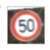
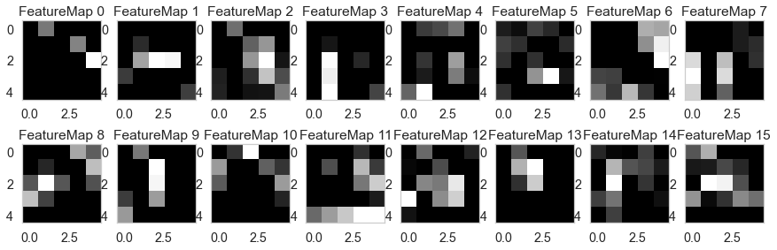
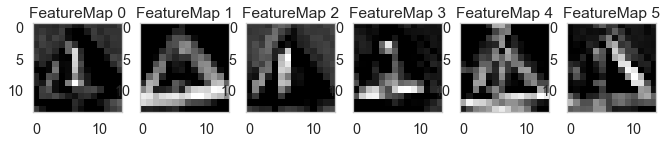

## Project: Traffic Sign Recognition Algorithm

  

 

  <b><i>Traffic sign classifier example and Convolutional Neural Network animation</i></b>

Overview
---
In this project, I used what I've learned about deep neural networks and convolutional neural networks to classify traffic signs. A model has been trained and validated so it can classify traffic sign images using the [German Traffic Sign Dataset](http://benchmark.ini.rub.de/?section=gtsrb&subsection=dataset). After the model was trained, I tried it out on images of German traffic signs that I find on the web.

The project is composed by three main files: 
* The Ipython notebook containing the source code
* The code exported as an html file
* A writeup report contained in this README 

### Data Set Summary & Exploration

#### 1. Basic summary of the data set.

I used the pandas library to calculate summary statistics of the traffic
signs data set:

* Number of training examples = 34799
* Number of validation examples = 4410
* Number of testing examples = 12630
* Image data shape = (32, 32, 3)
* Number of classes = 43

#### 2. Exploratory visualization of the dataset.

Here is an exploratory visualization of the data set. It is a bar chart showing how many images there are for each kind of traffic sign.

The example image below has been randomly picked from the set of training images.

### Design and Test a Model Architecture

#### 1. Preprocessing of the image data.

Image data has been standardised. Before standardisation, image data goes from 0 to 255. After standardisation, it goes from -1 to 1.

I decided not to convert the images to grayscale because this would prevent the model from using valuable information. Colour is used by humans to identify roadsigns and is a valuable piece of information for machines as well. 

#### 2. Description of the final model architecture.

My final model consisted of the following layers:

| Layer         		|     Description	        					| 
|:---------------------:|:---------------------------------------------:| 
| Input         		| 32x32x3 RGB image   							| 
| Convolution 5x5     	| 1x1 stride, valid padding, outputs 28x28x6 	|
| RELU					|												|
| Max pooling	      	| 2x2 stride,  outputs 14x14x6 				    |
| Convolution 5x5	    | 1x1 stride, valid padding, outputs 10x10x16   |
| RELU					|												|
| Max pooling	      	| 2x2 stride,  outputs 5x5x16 				    |
| Flatten   	      	| Input 5x5x16, output 400   				    |
| Dropout   	      	| Keep probability during training 70%		    |
| Fully connected		| Input 400, output 120 						|
| RELU					|												|
| Dropout   	      	| Keep probability during training 70%		    |
| Fully connected		| Input 120, output 84   						|
| Fully connected		| Input 84, output 43   					    |
| Softmax				|              									|

#### 3. Model training.

To train the model, I started with a learning rate of 0.001, batch size of 128 images and a duration of 20 epochs. These values yield good results and allow to experiment with different models and preprocessing methods.

Once the model and the preprocessing method were finalised. I changed the training method to allow for fine tuning. Based on previous result I aimed for an ambitious accuracy of 96.5% and the training would continue until this accuracy is reached. If the training ends after a fixed number of epochs the model is not guaranteed to be at the peek of its performance, as accuracy oscillates during training. Another advancement was made by reducing the learning rate whenever the accuracy decreases compared to the value achieved during the previous epoch. This technique allows for fine tuning as the training goes on, especially in its latest stages. 

#### 4. Approach taken for finding a solution and getting the validation set accuracy to be at least 93%.

My final model results were:
* training set accuracy of 99.8%%
* validation set accuracy of 96.8% 
* test set accuracy of 95.3%

The first architecture was a LeNet-5 model. It is a well known model in the field of computer vision and a good starting point for the project. Indeed, its convolutional layers take advantage of the position of pixels relative to each other, not just their value. The accuracy of this model was lower than the specified benchmark of 93% on the validation set due to overfitting. Adding dropout layers after the conv0 and conv1 layers reduced overfitting and increased accuracy on the validation set from 89.6% to 93.3%. Dropout randomly turns off some perceptrons during training to make sure that the network does not rely to much on them.

Max pooling was initially considered to be unnecessary and an obsolete way to reduce overfitting compared to dropout. Indeed, it discards some information that could be useful for classification. Experiments did not confirm this theory in this particular model so the max pooling layers have been kept.

The network has been brought from an accuracy of 93.3% to 96.8% during the fine tuning phase described above.

The final accuracy on the test set is 95.3% which means that the model is actually able to generalise and recognise pictures it has never seen before. The accuracy of the test set might be lower than the accuracy on the validation set because the training stops when the latter reaches a high value. 96.8% accuracy might be the result of luck since in the previous epoch the accuracy on the validation set was indeed 95.3% (same as the final accuracy on the test set).  

### Test a Model on New Images

#### 1. Displaying and analyzing five German traffic signs found on the web.

Here are five German traffic signs downloaded from the web:

   
 

They should not be difficult to analyze as light conditions are good in all images and they are not blurry.

Some problems that might arise are:
* A slight cutting of corners in the 1st and the 4th images.
* The presence of another sign below the main one in the 3rd image.
* The yellowing of the sign in the 3rd image again.

#### 2. Discussion of the model's predictions on the new traffic signs

Here are the results of the prediction:

| Image			        |     Prediction	        					| 
|:---------------------:|:---------------------------------------------:| 
| General Caution  		| General Caution								| 
| No Entry     			| No Entry 										|
| No Vehicles			| No Vehicles									|
| Right of Way     		| Right of Way					 				|
| Stop      			| Stop                							|

The model was able to correctly guess all 5 traffic signs, which gives an accuracy of 100%. This confirms the ability of the model to correctly classify images of traffic signs it has never seen before. Accuracy here is higher than the one registered on the test set because the number of traffic signs is much lower. Indeed, 5 traffic signs are not enough to formulate an accurate statistic.

#### 3. Certainty of the model's prediction when classifying each of the five new images.

The top 5 softmax probabilities for each image are shown below to give an idea of the certainty of the predictions and of the other options considered.

For the first image, the model is relatively sure that this is a General Caution sign (probability of 95.4%), and the image does contain a stop sign. The top five soft max probabilities were:

| Probability         	|     Prediction	        					| 
|:---------------------:|:---------------------------------------------:| 
| 95.4%        			| General caution   							| 
| 4.5%     				| Bumpy road 									|
| 0.1%					| Bicycles crossing								|
| 0.0%	      			| Road narrows on the right					 	|
| 0.0%				    | Pedestrians         							|

The model is 100% confident about the other 4 answers. All answers are correct.

| Probability         	|     Prediction	        					| 
|:---------------------:|:---------------------------------------------:| 
| 100.0%       			| No entry             							| 
| 0.0%     				| Speed limit (20km/h)							|
| 0.0%					| Stop          								|
| 0.0%	      			| Speed limit (30km/h)  					 	|
| 0.0%				    | Traffic signals      							|

| Probability         	|     Prediction	        					| 
|:---------------------:|:---------------------------------------------:| 
| 100.0%       			| No vehicles          							| 
| 0.0%     				| No passing        							|
| 0.0%					| Yield          								|
| 0.0%	      			| Speed limit (120km/h)    					 	|
| 0.0%				    | Speed limit (30km/h) 							|

| Probability         	|     Prediction	        					| 
|:---------------------:|:---------------------------------------------:| 
| 100.0%       			| Right-of-way at the next intersection         | 
| 0.0%     				| Beware of ice/snow   							|
| 0.0%					| Slippery road         						|
| 0.0%	      			| Children crossing     					 	|
| 0.0%				    | Double curve       							|

| Probability         	|     Prediction	        					| 
|:---------------------:|:---------------------------------------------:| 
| 100.0%       			| Stop                                          | 
| 0.0%     				| No entry             							|
| 0.0%					| Speed limit (20km/h)   						|
| 0.0%	      			| Speed limit (80km/h)     					 	|
| 0.0%				    | Bicycles crossing    							|

### (Optional) Visualizing the Neural Network
#### 1. Discussion of the visual output of the trained network's feature maps. What characteristics did the neural network use to make classifications?

The network recognises simple shapes and patterns like corners, straight lines, and symbols resembling the ones inside the roadsigns (with a bit of fantasy).

Together these shapes form more complex geometries similar to the actual roadsigns.

