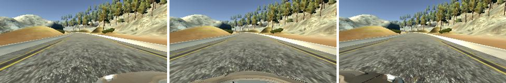
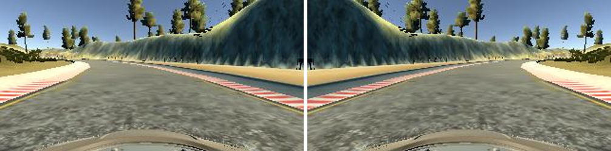

# **Behavioral Cloning** 

The project follows these steps:
* Using the simulator to collect data of good driving behavior.
* Building a convolution neural network in Keras that predicts steering angles from images.
* Training and validating the model with a training and validation set.
* Test that the model successfully drives around the track without leaving the road

---

### Project Files

This folder includes all required files and can be used to run the simulator in autonomous mode:
* model.py containing the script to create and train the model
* drive.py for driving the car in autonomous mode
* model.h5 containing a trained convolution neural network 

### Model Architecture and Training Strategy

#### 1. An appropriate model architecture has been employed

The model used is based on the End to End Learning for Self-Driving Cars used by NVIDIA on actual vehicles. It consists of three 5x5 and two 3x3 convolutional layers (model.py lines 52-59). The output of the convolutions is flattened and fed into 4 fully connected layers (model.py lines 61-68). 

Before entering the network, the data is normalized using a Keras lambda layer (code line 49). After normalization, the top and the bottom of the images is cropped to exclude the sky and the hood of the car from the decision making process (code line 50). The model includes RELU activations after every layer to introduce nonlinearity. The output of the model is a single value corresponding to the steering angle of the vehicle (code line 68).

#### 2. Attempts to reduce overfitting in the model

The model contains dropout layers in order to reduce overfitting (model.py lines 63-65). 

The model was trained and validated on different data sets to ensure that the model was not overfitting (code line 73). The model was tested by running it through the simulator and ensuring that the vehicle could complete a full lap on the track.

#### 3. Model parameter tuning

The model used an adam optimizer, so the learning rate was not tuned manually (model.py line 25).

#### 4. Appropriate training data

To keep the vehicle driving on the road I used a combination of center lane driving and augmented data. The augmented data consisted in using left and right camera to simulate the car driving closer to the edge of the road. A correction factor was then applied to the steering angle to simulate a sharper turn. All the images and the steering angles were flipped to have an equal number of right and left turns and help the network generalise better.

It would have been possible to record recovery maneuvers to teach the vehicle how to behave in case it went too close to the edge of the road. However, this can only be done in simulation and it is not safe on public roads so I decided not to resort to this technique.

### Model Architecture and Training Strategy

#### 1. Solution Design Approach

The overall strategy for deriving a model architecture was to experiment with more and more powerful networks and different positioning of dropout and pooling layers.

My first step was to use a simple network composed by just a fully connected layer. The objective of this step was just to check if the vehicle would respond to the decisions made by the network. The vehicle responded so it was just a matter of improving the network and the quality of the data.

To combat overfitting, I split my image and steering angle data into a training and validation set. The number of epochs was then chosen so the model had similar mean squared errors for the training set and the validation set. If the error ar similar it is implied that the model is not overfitting. 

The car was not steady while using this network and it finished off the edge of the road after a few meters but it was a reassuring first try nonetheless.

Then I used a LeNet-5 convolution neural network model similar to the one I used in the Traffic Sign Classifier Project. I thought this model might be appropriate because it did a great job on image recognition and generalising on new images. 

The car was steadier while using this network and could follow the road until the first sharp turn.

To combat overfitting, I added dropout layers.

The final architecture I implemented was based on a study published by NVIDIA that can be found at this link. I added max pooling and dropout layers to reduce the number of trainable parameters and avoid overfitting.

The final step was to run the simulator to see how well the car was driving around the track. There were a few spots where the vehicle fell off the track. To improve the driving behavior in these cases, I simply collected more data.

At the end of the process, the vehicle was able to drive autonomously around the track without leaving the road.

#### 2. Final Model Architecture

The final model architecture (model.py lines 48-68) consisted of a convolution neural network with the following layers and layer sizes:

 Layer         		    | Description   	        					| 
|:---------------------:|:---------------------------------------------:| 
| Input         		| 160x320x3 RGB image   						| 
| Lamda layer      		| Preprocessing: x / 255.0 - 0.5				| 
| Cropping2D      		| Cropping the top 75 and the bottom 25 pixels  | 
| Convolution 5x5     	| 1x1 stride, same padding, outputs 60x320x24 	|
| RELU					|												|
| Max pooling	      	| 2x2 stride,  outputs 30x160x24 				|
| Convolution 5x5	    | 1x1 stride, same padding, outputs 30x160x36   |
| RELU					|												|
| Max pooling	      	| 2x2 stride,  outputs 15x80x36 			    |
| Convolution 5x5	    | 1x1 stride, same padding, outputs 15x80x48    |
| RELU					|												|
| Max pooling	      	| 2x2 stride,  outputs 8x40x48 				    |
| Convolution 3x3	    | 1x1 stride, same padding, outputs 8x40x64     |
| RELU					|												|
| Convolution 3x3	    | 1x1 stride, same padding, outputs 8x40x64     |
| RELU					|												|
| Flatten   	      	| Input 8x40x64, output 204,800   				    |
| Fully connected		| Input 204,800, output 1,164 						|
| RELU					|												|
| Dropout   	      	| Drop probability during training 30%		    |
| Fully connected		| Input 1,164, output 100   						|
| RELU					|												|
| Dropout   	      	| Drop probability during training 30%		    |
| Fully connected		| Input 100, output 50   						|
| RELU					|												|
| Fully connected		| Input 50, output 10   						|
| RELU					|												|
| Fully connected		| Input 10, output 1   					    |

#### 3. Creation of the Training Set & Training Process

To capture good driving behavior, I recorded four clockwise and counterclockwise laps on the track using center lane driving. Here is an example image of center lane driving from left, center, and right cameras:

To augment the data sat, I also flipped images and angles thinking that this would allow the network to better generalise and avoid biases towards left or right turns. For example, here is an image that has then been flipped:

After the collection process, I had 24,108 data points. After flipping the number of images doubled to 48,216. I then preprocessed this data by standardising it. I divided the pixel values by 255 and subtracted 0.5 to obtain values between -0.5 and 0.5.

I finally randomly shuffled the data set and put 20% of the data into a validation set. 

I used this training data for training the model. The validation set helped determine if the model was over or under fitting. The ideal number of epochs was 2 as evidenced by the lack of improvement after the second epoch. Continuing the training would have caused overfitting. I used an adam optimizer so that manually training the learning rate wasn't necessary.
