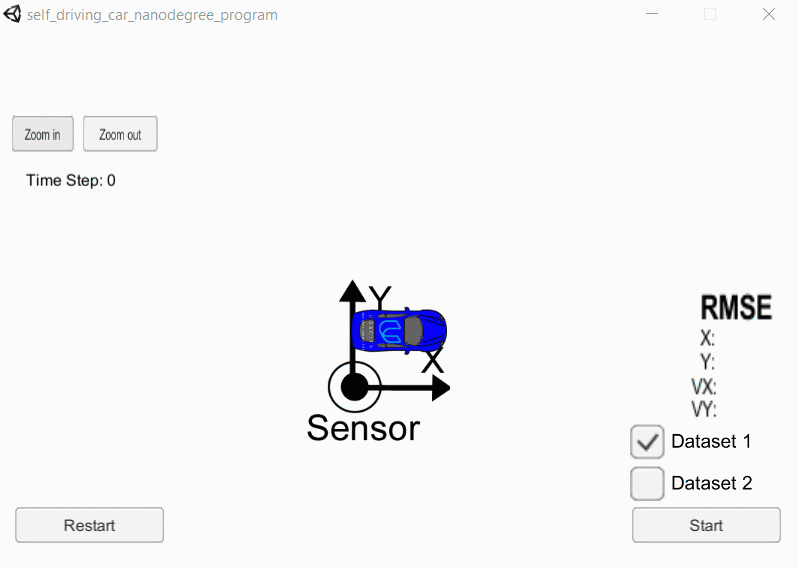

# Extended Kalman Filters

  

 

  <b><i>The Kalman filter fuses laser and radar data (red and blue) to determine the position of the vehicle (green).</i></b>

 

In this project I used a kalman filter to estimate the state of a moving object of interest with noisy lidar and radar measurements.
Each estimate is the product of the following steps: prediction and measurement update.

- Prediction: Estimates the state of the object based on its previous state, the physics of the object, and the time elapsed since the object was last observed.
- Measurement Update: Adjusts the estimate of the prediction step based on the new measurement. 

The accuracy of the estimates is measured using Root Mean Squared Error (RMSE). The RMSE values at the end of the run need to be below the following tolerances for the project to be successful. 

Tolerances     		    |    	                      					| 
|:---------------------:|:---------------------------------------------:| 
| RMSE x position  		| 0.11                     						| 
| RMSE y position  		| 0.11                     						| 
| RMSE x velocity  		| 0.52                     						| 
| RMSE y velocity  		| 0.52                     						| 

 

## Results WITH Sensor Fusion

In this section laser and radar data have been fused to produce position and velocity estimates. Fusing laser and radar data simply means that both of them have been trigger a prediction and measurement update. Running the extended kalman filter on dataset 1 and 2 yielded the following results for the RMSE:

RMSE Dataset 1 		    | RMSE Dataset 2               					| 
|:---------------------:|:---------------------------------------------:| 
| 0.0973          		| 0.0726                   						| 
| 0.0855          		| 0.0967                   						| 
| 0.4513          		| 0.4579                   						| 
| 0.4399          		| 0.4966                   						|

The accuracy of the estimates is similar for dataset 1 and dataset 2. This is because the velocity in the x and y direction has been initialised to 0. This gives no unfair advantage to one situation over another and ensures no false information is given about newly detected objects.

## Results WITHOUT Sensor Fusion

Laser and radar readings have not been fused in this section. Laser is more accurate than radar. It might be thought that by considering the radar readings the resulting estimates are less accurate, but this is not the case. Using only one sensor results in less accurate estimates and the RMSEs prove this point.

**Laser only:**

RMSE Dataset 1 		    | RMSE Dataset 2               					| 
|:---------------------:|:---------------------------------------------:| 
| 0.1222          		| 0.0961                   						| 
| 0.0984          		| 0.1003                   						| 
| 0.5825          		| 0.5418                   						| 
| 0.4567          		| 0.4640                   						|

**Radar only:**

RMSE Dataset 1 		    | RMSE Dataset 2               					| 
|:---------------------:|:---------------------------------------------:| 
| 0.1918          		| 0.2244                   						| 
| 0.2798          		| 0.2954                   						| 
| 0.5575          		| 0.5870                   						| 
| 0.6567          		| 0.7380                   						|

None of the sensors alone is enough to generate estimates that respect the tolerances.

## Running the Extended Kalman Filter on your Machine

This project involves the Term 2 Simulator which can be downloaded [here](https://github.com/udacity/self-driving-car-sim/releases).

This repository includes two files that can be used to set up and install [uWebSocketIO](https://github.com/uWebSockets/uWebSockets) for either Linux or Mac systems. For windows you can use either Docker, VMware, or even [Windows 10 Bash on Ubuntu](https://www.howtogeek.com/249966/how-to-install-and-use-the-linux-bash-shell-on-windows-10/). To install uWebSocketIO run install-linux.sh in the bash you chose.

Once the install for uWebSocketIO is complete, the main program can be built and run by doing the following from the project top directory.

1. mkdir build
2. cd build
3. cmake ..
4. make
5. ./ExtendedKF

Note that the programs that need to be written to accomplish the project are src/FusionEKF.cpp, src/FusionEKF.h, kalman_filter.cpp, kalman_filter.h, tools.cpp, and tools.h

The program main.cpp has already been filled out, but feel free to modify it.

Here is the main protocol that main.cpp uses for uWebSocketIO in communicating with the simulator.

**INPUT**: values provided by the simulator to the c++ program

["sensor_measurement"] => the measurement that the simulator observed (either lidar or radar)

**OUTPUT**: values provided by the c++ program to the simulator

["estimate_x"] <= kalman filter estimated position x

["estimate_y"] <= kalman filter estimated position y

["rmse_x"]

["rmse_y"]

["rmse_vx"]

["rmse_vy"]

## Other Important Dependencies

* cmake >= 3.5
  * All OSes: [click here for installation instructions](https://cmake.org/install/)
* make >= 4.1 (Linux, Mac), 3.81 (Windows)
  * Linux: make is installed by default on most Linux distros
  * Mac: [install Xcode command line tools to get make](https://developer.apple.com/xcode/features/)
  * Windows: [Click here for installation instructions](http://gnuwin32.sourceforge.net/packages/make.htm)
* gcc/g++ >= 5.4
  * Linux: gcc / g++ is installed by default on most Linux distros
  * Mac: same deal as make - [install Xcode command line tools](https://developer.apple.com/xcode/features/)
  * Windows: recommend using [MinGW](http://www.mingw.org/)

## Basic Build Instructions

1. Clone this repo.
2. Make a build directory: `mkdir build && cd build`
3. Compile: `cmake .. && make` 
   * On windows, you may need to run: `cmake .. -G "Unix Makefiles" && make`
4. Run it: `./ExtendedKF `

## Generating Additional Data

If you'd like to generate your own radar and lidar data, see the
[utilities repo](https://github.com/udacity/CarND-Mercedes-SF-Utilities) for
Matlab scripts that can generate additional data.