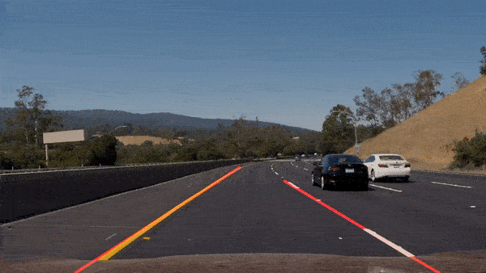

# Self-Driving Car Nanodegree

 

At the end of April 2020 I started the Udacity Self-Driving Car Nanodegree!

This repository contains the projects I completed so far:

 

## Project 1: Finding Lane Lines ##
- [Repository](https://github.com/EdoardoCocconi/Udacity-Self-Driving-Car-Nanodegree/tree/master/Project%201%20-%20Finding%20Lane%20Lines)
- [Jupyter Notebook](https://nbviewer.jupyter.org/github/EdoardoCocconi/Udacity-Self-Driving-Car-Nanodegree/blob/master/Project%201%20-%20Finding%20Lane%20Lines/Project_Interactive_Notebook.ipynb)
- [Python source code](https://github.com/EdoardoCocconi/Udacity-Self-Driving-Car-Nanodegree/blob/master/Project%201%20-%20Finding%20Lane%20Lines/Project.py)
- [Output videos](https://github.com/EdoardoCocconi/Udacity-Self-Driving-Car-Nanodegree/tree/master/Project%201%20-%20Finding%20Lane%20Lines/test_videos_output)

 

  

 

  <b><i>Finding lane lines regardless of color</i></b>

 

## Project 2: Advanced Lane Finding ##

- [Repository](https://github.com/EdoardoCocconi/Udacity-Self-Driving-Car-Nanodegree/tree/master/Project%202%20-%20Advanced%20Lane%20Finding)
- [Python lane-finding source code](https://github.com/EdoardoCocconi/Udacity-Self-Driving-Car-Nanodegree/blob/master/Project%202%20-%20Advanced%20Lane%20Finding/Lane_Finder_Video.py)
- [Python camera calibration source code](https://github.com/EdoardoCocconi/Udacity-Self-Driving-Car-Nanodegree/blob/master/Project%202%20-%20Advanced%20Lane%20Finding/Camera_Calibration.py)

 

  

 

  <b><i>Detecting lanes regardless of turns and lighting conditions</i></b>

 

## Project 3: Traffic Sign Classifier (Machine Learning) ##

- [Repository](https://github.com/EdoardoCocconi/Udacity-Self-Driving-Car-Nanodegree/tree/master/Project%203%20-%20Traffic%20Sign%20Classifier)
- [Jupyter Notebook](https://github.com/EdoardoCocconi/Udacity-Self-Driving-Car-Nanodegree/blob/master/Project%203%20-%20Traffic%20Sign%20Classifier/Traffic_Sign_Classifier.ipynb)

 

  

 

  <b><i>Traffic sign classifier example and Convolutional Neural Network animation</i></b>

 

## Project 4: Behavioral Cloning (Machine Learning) ##

- [Repository](https://github.com/EdoardoCocconi/Udacity-Self-Driving-Car-Nanodegree/tree/master/Project%204%20-%20Behavioral%20Cloning)
- [Python Source Code](https://github.com/EdoardoCocconi/Udacity-Self-Driving-Car-Nanodegree/blob/master/Project%204%20-%20Behavioral%20Cloning/Behavioral_Cloning.py)

 

  

 

  <b><i>The vehicle is able to complete a full lap around the track in autonomous mode</i></b>

 
 
 

> *©  2020  Edoardo  M.  Cocconi  All  Rights  Reserved*
